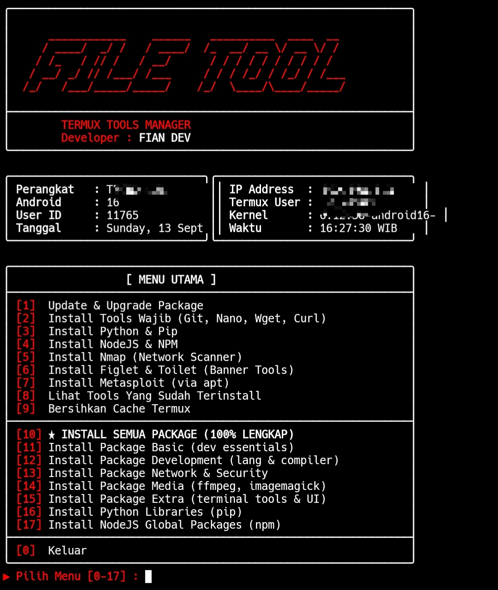

<!--
 ╔═══════════════════════════════════════════════════════════════╗
 ║  🛠️  TERMUX TOOLS MANAGER — CLI Toolkit                      ║
 ║  Author: FIAN DEV                                          ║
 ║  Version: 3.0.0                                            ║
 ╚═══════════════════════════════════════════════════════════════╝
-->

<h1 align="center">
  
</h1>

<p align="center">
  
</p>

<p align="center">
  
  
  
  
</p>

---

## ⚠️ PERINGATAN — BACA DULU

> **<span style="color:red">‼️ IMPORTANT</span>**
>
> Tools ini **khusus untuk Termux (Android)** dan hanya berjalan di lingkungan Termux.
> Script ini **bukan tools hacking/ilegal** — hanya installer package untuk mempermudah setup Termux.
> Namun, beberapa package (nmap, metasploit, dll) bisa disalahgunakan — **pengguna bertanggung jawab penuh** atas penggunaannya.
> Penulis **tidak bertanggung jawab** atas penyalahgunaan tools ini.

---

## 📌 TENTANG TOOLS

**TERMUX TOOLS MANAGER** adalah script Bash all-in-one untuk menginstall 60+ package di Termux dengan **satu perintah**. Cocok untuk:

- ✅ **Setup Termux baru** — install semua essentials dalam sekali klik
- ✅ **Developer mobile** — Python, Node, Go, Rust, PHP siap pakai
- ✅ **Security researcher** — nmap, metasploit, hydra, sqlmap, dll
- ✅ **Belajar Linux** — tanpa perlu hafal nama package satu-satu
- ✅ **Hemat waktu** — tidak perlu ketik `pkg install` berulang-ulang

### 🎯 FITUR LENGKAP

| No | Fitur | Deskripsi |
|----|-------|-----------|
| 1 | **17 Menu Interaktif** | Navigasi menu rapi dengan warna & border box |
| 2 | **Auto Update Repo** | `pkg update && pkg upgrade` sekali pilih |
| 3 | **Basic Dev Essentials** | Git, nano, vim, wget, curl, openssl, dll |
| 4 | **Development Languages** | Python, Node.js, Go, Rust, Ruby, PHP, Perl, Clang |
| 5 | **Network & Security** | nmap, netcat, whois, dnsutils, tsu, iproute2 |
| 6 | **Media Tools** | FFmpeg, ImageMagick, SoX |
| 7 | **Extra Terminal Tools** | figlet, toilet, cowsay, neofetch, htop, tmux, fzf, jq |
| 8 | **Metasploit Installer** | Auto-install unstable-repo + metasploit |
| 9 | **Python Libraries** | requests, bs4, colorama, rich, pyfiglet, lolcat, dll |
| 10 | **NPM Global Packages** | npm-check-updates & lainnya |
| 11 | **Progress Bar** | Visual progress bar 40-char per package |
| 12 | **Summary Sukses/Gagal** | Ringkasan package berhasil & gagal di akhir |
| 13 | **Device Info Panel** | Tampilkan model HP, Android, kernel, IP, user, waktu |
| 14 | **Auto Clear Screen** | Bersihkan layar tiap kembali ke menu |
| 15 | **Cache Cleaner** | Bersihkan apt cache & .deb yang menumpuk |
| 16 | **List Installed Packages** | Tampilkan daftar package yang sudah terinstall |
| 17 | **Auto Padding Box** | Border box selalu rapi walau teks panjang/pendek |
| 18 | **Anti-ANSI Padding Bug** | Hitung panjang string ignore ANSI escape code |
| 19 | **Warna Original** | Merah, putih, hijau konsisten khas FIAN DEV |
| 20 | **Loop Menu** | Terus kembali ke menu sampai pilih keluar |

---

## 🔧 INSTALASI LENGKAP

### 📋 Prasyarat

| Komponen | Minimal |
|----------|---------|
| Aplikasi | **Termux** (dari F-Droid, bukan Play Store) |
| Android | 7.0+ |
| Storage | ~500 MB (kalau install semua) |
| Koneksi | Internet stabil |

> ⚠️ **PENTING:** Download Termux dari [F-Droid](https://f-droid.org/en/packages/com.termux/) — versi Play Store sudah deprecated dan tidak bisa install package dengan benar.

### 🚀 Step-by-Step

#### 1. Langkah instalasi 🛠️

```bash
# Update repo & install git
pkg update && pkg upgrade -y
pkg install -y git

# Clone repository
git clone https://github.com/FianDev/termux-tools-manager
cd termux-tools-manager

# Beri izin executable
chmod +x tools.sh

# Jalankan tools
./tools.sh